# Memoflow Architecture Diagram

## Complete System Architecture

```mermaid
graph TB
    subgraph CLIENT["📱 FRONTEND - React Native (Expo)"]
        direction TB
        APP["App.tsx<br/>Entry Point"]
        
        subgraph SCREENS["📱 Screens (48+)"]
            S1["Auth Screens<br/>Login/Register"]
            S2["Learning Screens<br/>Vocabulary/Grammar<br/>Listening/Stories"]
            S3["Flashcard Screens<br/>Set/Review"]
            S4["Quiz Screens<br/>Various Games"]
            S5["Statistics<br/>Dashboard/Charts"]
            S6["Chat & Settings<br/>Notifications"]
        end
        
        subgraph COMP["🧩 Components"]
            C1["Header/Footer"]
            C2["Cards & Lists"]
            C3["Quiz/Game Comps"]
            C4["Modals & Overlays"]
            C5["Shared Components"]
        end
        
        subgraph API_LAYER["🔌 API & Services"]
            APICLIENT["API Client<br/>HTTP Calls"]
            WS["WebSocket<br/>STOMP"]
            STORAGE["AsyncStorage<br/>Local Data"]
            NOTIFY["Push Notif<br/>Expo + Firebase"]
        end
        
        APP --> SCREENS
        APP --> COMP
        SCREENS --> API_LAYER
        COMP --> API_LAYER
    end

    subgraph NETWORK["🔗 Network Layer"]
        direction LR
        HTTP["HTTP/REST<br/>JSON"]
        WEBSOCKET["WebSocket<br/>STOMP Protocol"]
    end

    subgraph SERVER["🖥️ BACKEND - Spring Boot"]
        direction TB
        
        subgraph FILTERS["🔒 Request Filters"]
            CORS["CORS Filter"]
            JWT["JWT Auth Filter"]
            VALID["Validation"]
        end
        
        subgraph CONTROLLERS["🎯 Controllers (16)"]
            AUTH["AuthController<br/>login, register"]
            USER["UserController<br/>profile, update"]
            WORD["WordController<br/>vocabulary"]
            LEARN["LearningLessonCtrl<br/>lessons, quiz"]
            FLASH["FlashcardCtrl<br/>review, study"]
            STAT["StatisticsCtrl<br/>progress, charts"]
            CHAT["AiChatController<br/>messages"]
            NOTIF["NotificationCtrl<br/>alerts"]
            WS_CTRL["WebSocketCtrl<br/>real-time"]
            SETTING["SettingController<br/>preferences"]
            ADMIN["AdminController<br/>dashboard"]
            STORY["StoryLessonCtrl"]
            HUNT["WordHuntCtrl"]
            RACE["WordRaceCtrl"]
            SUGG["SuggestionCtrl"]
            DEVICE["DeviceTokenCtrl"]
        end
        
        subgraph SERVICES["⚙️ Services (29)"]
            SU["UserService"]
            SW["WordService"]
            SL["LessonService"]
            SQ["QuizService"]
            SF["FlashcardService"]
            SS["StatisticsService"]
            SC["ChatService"]
            SN["NotificationService"]
            SP["PushNotifService"]
            SA["ActivityService"]
            SM["MessageService"]
            SV["VerificationService"]
            SRL["RoleService"]
            SD["DeviceTokenService"]
            SVE["VectorService"]
            SWH["WordHuntService"]
            SWR["WordRaceService"]
            SST["StoryService"]
            SCHED["SchedulerService"]
            SCLD["CloudinaryService"]
            SAI["AiProviderService"]
            SLIM["LearningModeService"]
            SQA["QuizAnswerService"]
            SSET["SettingService"]
            SQOP["QuizOptionService"]
            SQGP["QuizGroupService"]
            SLMA["LearningActivityService"]
            SUQA["UserQuizAnswerService"]
            SSOCKET["SocketPushService"]
        end
        
        subgraph REPOS["📦 Repositories (20)"]
            RU["UserRepository"]
            RW["WordRepository"]
            RL["LessonRepository"]
            RQ["QuizRepository"]
            RF["FlashcardRepository"]
            RM["MessageRepository"]
            RN["NotificationRepository"]
            RC["ChatSessionRepository"]
            RDT["DeviceTokenRepository"]
            RA["ActivityRepository"]
            RS["SettingRepository"]
            RV["VerificationRepository"]
            RQOP["QuizOptionRepository"]
            RQGP["QuizGroupRepository"]
            RQANS["QuizAnswerRepository"]
            RUQA["UserQuizAnswerRepository"]
            RLPROG["UserLessonProgressRepository"]
            RLMODE["LearningModeRepository"]
            RQQUEST["QuizQuestionRepository"]
            RMEDIA["MediaRepository"]
        end
        
        subgraph CONFIG["⚙️ Configuration"]
            JWTPROV["JWT Provider"]
            SEC["SecurityConfig"]
            WSCONFIG["WebSocketConfig"]
            SCHED_CONFIG["SchedulingConfig"]
        end
        
        FILTERS --> CONTROLLERS
        CONTROLLERS --> SERVICES
        SERVICES --> REPOS
        SERVICES --> CONFIG
    end

    subgraph DATABASE["💾 DATABASE - MySQL"]
        direction TB
        
        subgraph USERS_DB["👤 Users (3 tables)"]
            U1["User"]
            U2["Role"]
            U3["VerificationCode"]
        end
        
        subgraph LEARNING_DB["📚 Learning (7 tables)"]
            L1["Word"]
            L2["LearningLesson"]
            L3["LearningMode"]
            L4["QuizQuestion"]
            L5["QuizOption"]
            L6["QuizGroup"]
            L7["QuizAnswer"]
        end
        
        subgraph PROGRESS_DB["📈 Progress (4 tables)"]
            P1["UserLessonProgress"]
            P2["UserQuizAnswer"]
            P3["FlashcardReview"]
            P4["LearningActivity"]
        end
        
        subgraph COMM_DB["💬 Communication (2 tables)"]
            CM1["ChatSession"]
            CM2["Message"]
        end
        
        subgraph NOTIF_DB["🔔 Notifications (2 tables)"]
            N1["Notification"]
            N2["DeviceToken"]
        end
        
        subgraph CONFIG_DB["⚙️ Config (3 tables)"]
            CF1["Setting"]
            CF2["Media"]
            CF3["PrivacyMode"]
        end
    end

    subgraph EXTERNAL["☁️ External Services"]
        direction TB
        
        FIREBASE["🔔 Firebase<br/>Push Notifications<br/>Cloud Messaging"]
        
        GEMINI["🤖 Google Gemini AI<br/>AI Chat<br/>Learning Assistance"]
        
        CLOUDINARY["🖼️ Cloudinary<br/>Image Storage<br/>Media Management<br/>CDN"]
        
        GOOGLE_AUTH["🔐 Google OAuth<br/>Social Login<br/>Sign-In"]
    end

    %% Frontend to Network
    API_LAYER --> HTTP
    API_LAYER --> WEBSOCKET
    
    %% Network to Backend
    HTTP --> FILTERS
    WEBSOCKET --> WS_CTRL
    
    %% Backend Internal Flow
    FILTERS --> CONTROLLERS
    
    %% Controllers to Services
    AUTH --> SU
    USER --> SU
    WORD --> SW
    LEARN --> SL
    FLASH --> SF
    STAT --> SS
    CHAT --> SC
    NOTIF --> SN
    WS_CTRL --> SN
    SETTING --> SSET
    ADMIN --> SU
    STORY --> SST
    HUNT --> SWH
    RACE --> SWR
    SUGG --> SW
    DEVICE --> SD
    
    %% Services to Repositories
    SU --> RU
    SW --> RW
    SL --> RL
    SQ --> RQ
    SF --> RF
    SC --> RC
    SN --> RN
    SA --> RA
    SM --> RM
    SV --> RV
    SD --> RDT
    
    %% All Repos to Database
    RU --> USERS_DB
    RW --> LEARNING_DB
    RL --> LEARNING_DB
    RQ --> LEARNING_DB
    RF --> PROGRESS_DB
    RC --> COMM_DB
    RM --> COMM_DB
    RN --> NOTIF_DB
    RDT --> NOTIF_DB
    RA --> PROGRESS_DB
    RS --> CONFIG_DB
    RV --> USERS_DB
    RQOP --> LEARNING_DB
    RQGP --> LEARNING_DB
    RQANS --> LEARNING_DB
    RUQA --> PROGRESS_DB
    RLPROG --> PROGRESS_DB
    RLMODE --> LEARNING_DB
    RQQUEST --> LEARNING_DB
    RMEDIA --> CONFIG_DB
    
    %% Services to External APIs
    SN --> FIREBASE
    SP --> FIREBASE
    SC --> GEMINI
    SAI --> GEMINI
    SU --> GOOGLE_AUTH
    SCLD --> CLOUDINARY
    SW --> CLOUDINARY
    
    %% Frontend to External
    NOTIFY --> FIREBASE
    
    %% Styling
    style CLIENT fill:#e3f2fd,stroke:#1976d2,stroke-width:3px
    style SCREENS fill:#bbdefb,stroke:#1976d2
    style COMP fill:#bbdefb,stroke:#1976d2
    style API_LAYER fill:#90caf9,stroke:#1976d2
    
    style NETWORK fill:#f3e5f5,stroke:#7b1fa2,stroke-width:2px
    
    style SERVER fill:#fff3e0,stroke:#f57c00,stroke-width:3px
    style FILTERS fill:#ffe0b2,stroke:#f57c00
    style CONTROLLERS fill:#ffcc80,stroke:#f57c00
    style SERVICES fill:#ffb74d,stroke:#f57c00
    style REPOS fill:#ffa726,stroke:#f57c00
    style CONFIG fill:#ff9800,stroke:#f57c00
    
    style DATABASE fill:#e8f5e9,stroke:#388e3c,stroke-width:3px
    style USERS_DB fill:#c8e6c9,stroke:#388e3c
    style LEARNING_DB fill:#a5d6a7,stroke:#388e3c
    style PROGRESS_DB fill:#81c784,stroke:#388e3c
    style COMM_DB fill:#66bb6a,stroke:#388e3c
    style NOTIF_DB fill:#4caf50,stroke:#388e3c
    style CONFIG_DB fill:#43a047,stroke:#388e3c
    
    style EXTERNAL fill:#fce4ec,stroke:#c2185b,stroke-width:2px
    style FIREBASE fill:#f8bbd0,stroke:#c2185b
    style GEMINI fill:#f8bbd0,stroke:#c2185b
    style CLOUDINARY fill:#f8bbd0,stroke:#c2185b
    style GOOGLE_AUTH fill:#f8bbd0,stroke:#c2185b
```



---

## Architecture Layers Breakdown

### 📱 Frontend (React Native + Expo)
- **48+ Screens**: Auth, Learning, Flashcard, Quiz, Statistics, Chat, Settings
- **Components**: Reusable UI elements, modals, cards, game components
- **API Layer**: HTTP client, WebSocket (STOMP), AsyncStorage, Push notifications
- **Technology**: Expo 54.0.33, React 19.1.0, TypeScript, @stomp/stompjs

### 🖥️ Backend (Spring Boot)
- **16 Controllers**: REST endpoints for all features
- **29 Services**: Business logic for each domain
- **20 Repositories**: JPA data access layer
- **Configuration**: JWT, Security, WebSocket, Scheduling
- **Technology**: Spring Boot 4.0.3, Java 17, JPA/Hibernate

### 💾 Database (MySQL)
- **23 Tables**: Users, Learning content, Progress, Chat, Notifications, Settings
- **Relationships**: Properly normalized with foreign keys
- **Connection Pooling**: For high concurrency

### ☁️ External Services
- **Firebase**: Push notifications via FCM
- **Google Gemini AI**: AI chat and learning assistance
- **Cloudinary**: Image/file storage and CDN
- **Google OAuth**: Social authentication

---

## Data Flow

### Authentication Flow
```
User enters credentials
  → POST /api/auth/login
  → AuthController validates
  → UserService checks database
  → JWT token generated
  → Returns token + user info
  → Store in AsyncStorage
  → Authenticated
```

### Real-Time Notification Flow
```
System event triggered
  → Backend creates notification
  → WebSocketController broadcasts to /topic/notifications/{userId}
  → Client receives via STOMP
  → Shows push notification via Firebase
  → Updates UI
```

### Learning Flow
```
User selects lesson
  → GET /api/lessons/{id}
  → LearningLessonController fetches
  → LessonService + QuizService load data
  → Returns lesson content + questions
  → User completes quiz
  → POST /api/lessons/{id}/submit
  → Validates answers, calculates score
  → Saves progress to database
  → Updates statistics
  → Returns result to client
```

### AI Chat Flow
```
User sends message
  → POST /api/chat/message
  → AiChatController receives
  → ChatService sends to Google Gemini API
  → Receives AI response
  → Saves conversation to ChatSession table
  → Returns response to client
  → Displays in chat UI
```

---

## Security Architecture

```
Request comes in
  ↓
CORS Filter (check origin)
  ↓
JWT Authentication Filter (validate token)
  ↓
Load user details via Spring Security
  ↓
@PreAuthorize (method-level authorization)
  ↓
Controller → Service → Repository
  ↓
Response with DTO
```

**Auth Details:**
- JWT tokens with 24h expiry
- Passwords hashed with bcrypt
- Role-based access control (RBAC)
- Secure endpoints for admin functions

---

## API Endpoints Summary

| Controller | Key Endpoints |
|-----------|---|
| **AuthController** | POST /api/auth/login, /register, /refresh-token |
| **UserController** | GET /api/users/profile, PUT /api/users/update |
| **WordController** | GET /api/words, /api/words/{id}, POST /api/suggestions |
| **LearningLessonController** | GET /api/lessons, POST /api/lessons/{id}/submit |
| **FlashcardReviewController** | GET /api/flashcards, POST /api/flashcards/review |
| **StatisticsController** | GET /api/statistics/daily, /progress, /heatmap |
| **AiChatController** | POST /api/chat/message, GET /api/chat/sessions |
| **NotificationController** | GET /api/notifications, PATCH /mark-read |
| **SettingController** | GET /api/settings, PUT /api/settings |
| **WebSocket** | WS /ws/notifications (STOMP) |

---

## Technology Stack

| Layer | Technology | Version |
|-------|-----------|---------|
| **Frontend** | React Native + Expo | 0.81.5 + 54.0.33 |
| **Frontend Lang** | TypeScript | 5.9.2 |
| **Backend** | Spring Boot | 4.0.3 |
| **Backend Lang** | Java | 17 |
| **Database** | MySQL | 8.0+ |
| **Authentication** | JWT | jjwt 0.11.5 |
| **WebSocket** | Spring WebSocket + STOMP | Built-in |
| **ORM** | Spring Data JPA | Built-in |
| **File Storage** | Cloudinary | CDN |
| **Notifications** | Firebase Admin SDK | 9.2.0 |
| **AI** | Google Generative AI | Latest |
| **ML** | DeepLearning4j Word2Vec | 1.0.0 |
| **Containerization** | Docker | Latest |

---

## Key Features

✅ **Mobile Learning Platform** - Cross-platform (iOS/Android) via Expo
✅ **Real-Time Notifications** - WebSocket + STOMP + Firebase Push
✅ **AI-Powered Chat** - Google Gemini integration for learning assistance
✅ **Comprehensive Statistics** - Progress tracking and learning analytics
✅ **Flashcard System** - Spaced repetition for vocabulary
✅ **Multiple Learning Modes** - Vocabulary, Grammar, Listening, Stories, Games
✅ **User Authentication** - JWT + OAuth2 (Google)
✅ **Secure** - Spring Security, method-level authorization, password hashing
✅ **Scalable** - Horizontal scaling ready with load balancer
✅ **Cloud Ready** - Docker containerization, external services integration

---

## File Structure

```
Memoflow/
├── FrontEnd/memoflow/src/
│   ├── screens/           (48+ screens)
│   ├── components/        (Reusable UI)
│   ├── api/               (API client)
│   ├── services/          (Business logic)
│   ├── hooks/             (Custom hooks)
│   ├── utils/             (Helpers)
│   ├── types/             (TypeScript types)
│   ├── constants/         (App constants)
│   └── theme/             (Styling)
│
├── BackEnd/memoflow/src/main/java/com/memoflow/memoflow/
│   ├── controller/        (16 REST controllers)
│   ├── service/           (29 services)
│   ├── repository/        (20 JPA repositories)
│   ├── entity/            (23 JPA entities)
│   ├── dto/               (Request/Response DTOs)
│   ├── config/            (Configuration)
│   ├── security/          (JWT, Auth config)
│   ├── exception/         (Custom exceptions)
│   ├── handler/           (Exception handler)
│   ├── validator/         (Custom validators)
│   └── util/              (Utilities)
│
└── ARCHITECTURE.md        (This file)
```

---

**Version**: 1.0  
**Last Updated**: 2026-05-19  
**Status**: Complete Production Architecture
