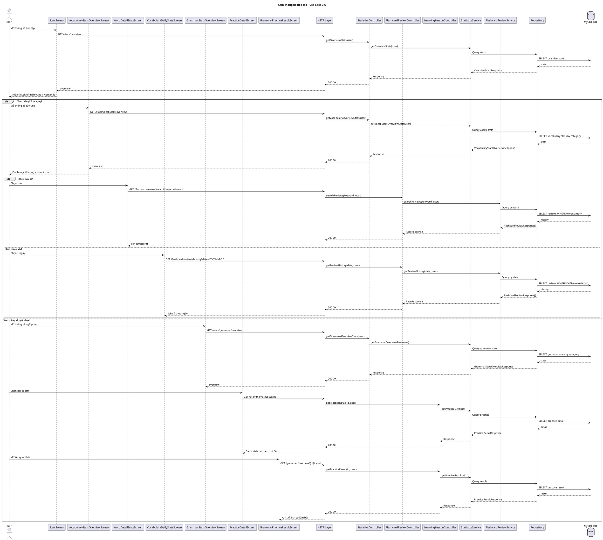

# Sequence Diagram - Xem thống kê học tập

**Thành phần thực tế**
- **BE:** `StatisticsController`, `FlashcardReviewController`, `LearningLessonController`, `StatisticsService`, `FlashcardReviewService`
- **FE:** `StatsScreen`, `VocabularyStatsOverviewScreen`, `WordDetailStatsScreen`, `VocabularyDailyStatsScreen`, `ListeningStatsOverviewScreen`, `ListeningLessonsScreen`, `ListeningLessonResultScreen`, `GrammarStatsOverviewScreen`, `PracticeDetailScreen`, `GrammarPracticeResultScreen`

