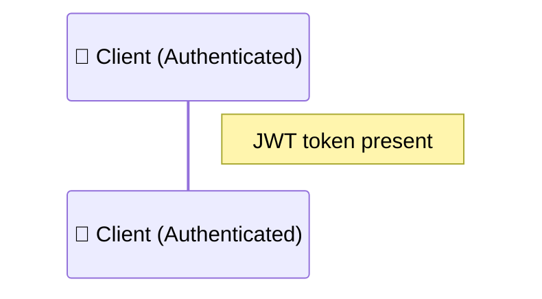
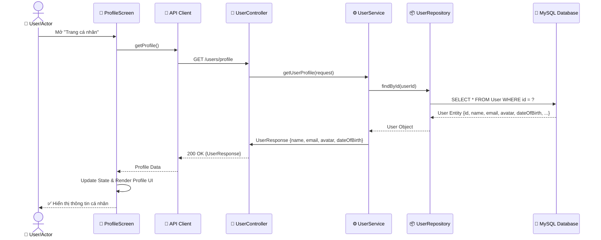
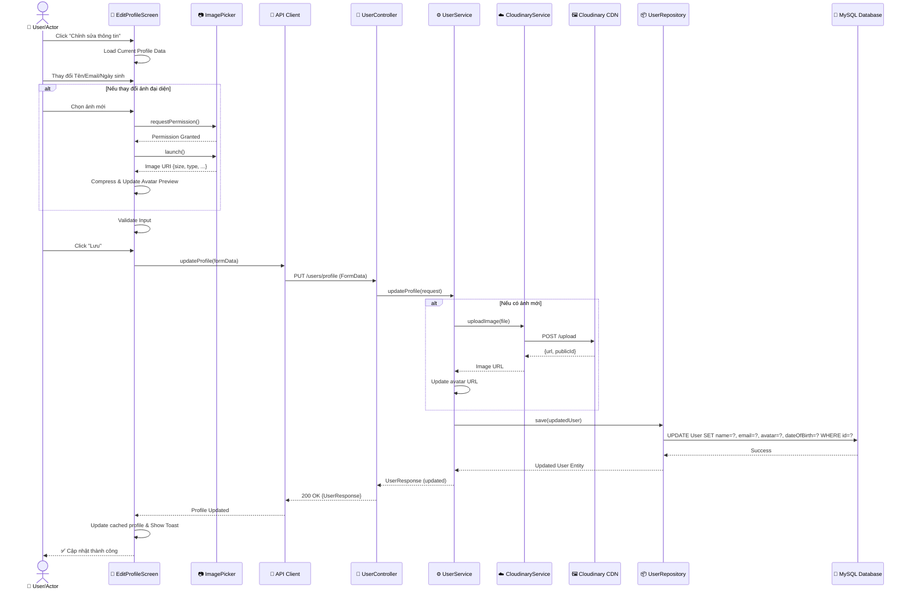
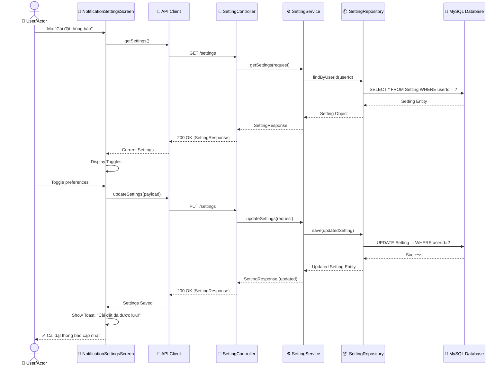
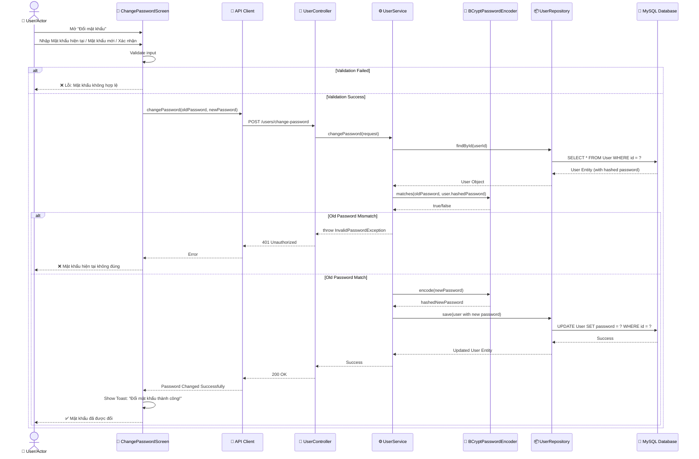
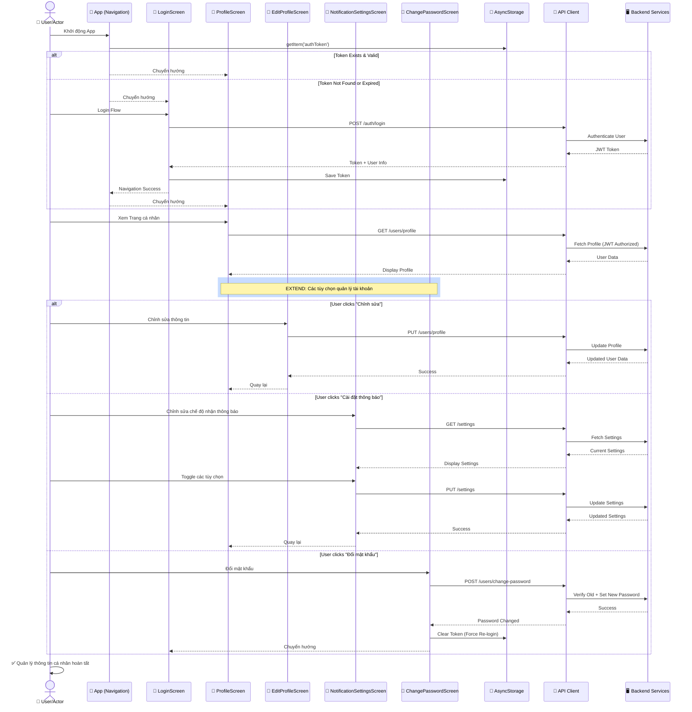

# Sequence Diagram - Quản lý Thông tin Cá nhân (Use Case 3.4.1)

Sequence Diagram cho Use Case "Quản lý Thông tin Cá nhân" (Personal Information Management) với các tương tác chính:
- Đăng nhập (Login) [INCLUDE]
- Xem Thông tin Cá nhân (View Profile)
- Chỉnh sửa Thông tin Cá nhân (Edit Profile) [EXTEND]
- Chỉnh sửa Chế độ Nhận Thông báo (Edit Notification Settings) [EXTEND]
- Đổi Mật khẩu (Change Password) [EXTEND]

## 1. Use Case: Đăng nhập (Login) - INCLUDE

> NOTE: Đăng nhập là bắt buộc cho "Quản lý thông tin cá nhân" nhưng chi tiết quy trình đăng nhập được bỏ qua ở đây. Các luồng sau giả định người dùng đã xác thực và có JWT token hợp lệ trong header Authorization.




---

## 2. Use Case: Xem Thông tin Cá nhân (View Profile)



---

## 3. Use Case: Chỉnh sửa Thông tin Cá nhân (Edit Profile) [EXTEND]



---

## 4. Use Case: Chỉnh sửa Chế độ Nhận Thông báo (Edit Notification Settings) [EXTEND]



---

## 5. Use Case: Đổi Mật khẩu (Change Password) [EXTEND]



---

## 6. Complete Flow: Quản lý Thông tin Cá nhân (Full Use Case)



---

## 7. Architecture Components Summary

### Frontend Components (React Native)
| Component | Responsibility |
|-----------|---|
| **LoginScreen** | Handle login/logout, JWT token storage |
| **ProfileScreen** | Display user profile, navigation to management options |
| **EditProfileScreen** | Update personal info, avatar upload |
| **NotificationSettingsScreen** | Toggle notification preferences |
| **ChangePasswordScreen** | Change password with validation |
| **AsyncStorage** | Persist JWT token locally |
| **API Client** | HTTP requests with Authorization header |

### Backend Components (Spring Boot)
| Component | Responsibility |
|-----------|---|
| **AuthController** | Handle login, register, JWT generation |
| **UserController** | Profile operations (GET, PUT) |
| **SettingController** | Notification settings (GET, PUT) |
| **JWT Auth Filter** | Request validation, extract UserPrincipal |
| **AuthService** | Authentication logic, password validation |
| **UserService** | User profile management |
| **SettingService** | Settings management |
| **PasswordEncoder** | BCrypt password hashing/verification |

### Database (MySQL)
| Table | Purpose |
|-------|---------|
| **User** | Store user credentials, profile (id, email, password, name, avatar, dateOfBirth, ...) |
| **Setting** | Store user preferences (id, userId, emailNotification, pushNotification, ...) |

### Security & Authentication
- **JWT Token**: 24-hour expiry, stored in AsyncStorage
- **CORS Filter**: Validates origin
- **JWT Auth Filter**: Validates token signature & expiry
- **Password Hashing**: BCrypt with salt
- **@AuthenticationPrincipal**: Spring Security integration

---

## Data Flow Summary

```
User Action 
  ↓
Frontend Screen (Validation)
  ↓
API Client (HTTP + JWT Token)
  ↓
Backend: JWT Filter (Authorization)
  ↓
Backend: Controller (Request Mapping)
  ↓
Backend: Service (Business Logic)
  ↓
Backend: Repository (Data Access)
  ↓
Database: CRUD Operations
  ↓
Response Flow (DTO Conversion)
  ↓
Frontend: Update State & UI
  ↓
User Sees Result ✅
```

---

**Version**: 1.0  
**Last Updated**: 2026-05-21  
**Compliance**: Enterprise-level Sequence Diagram with Actor, Controller, Service, Repository, Database layers
