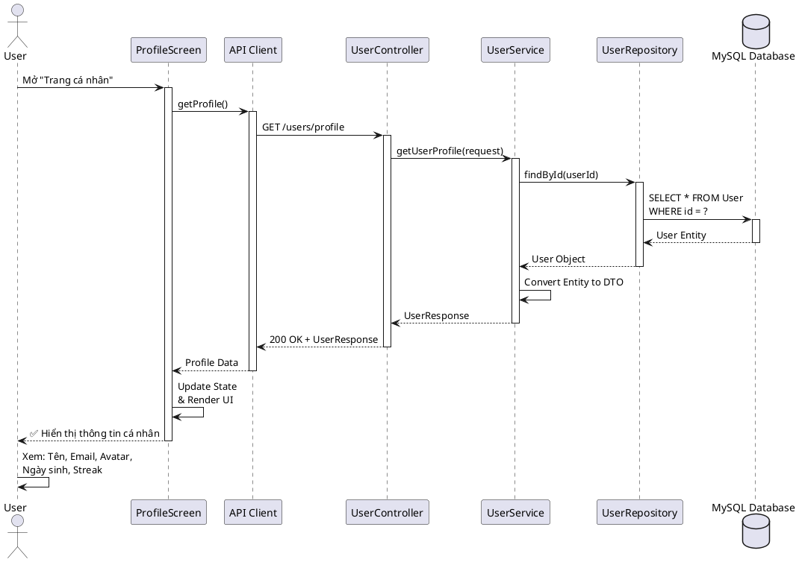
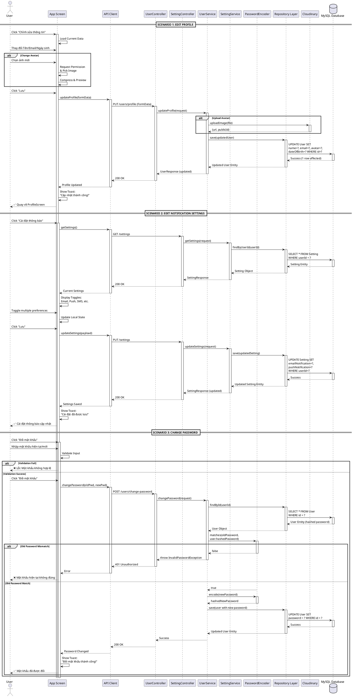
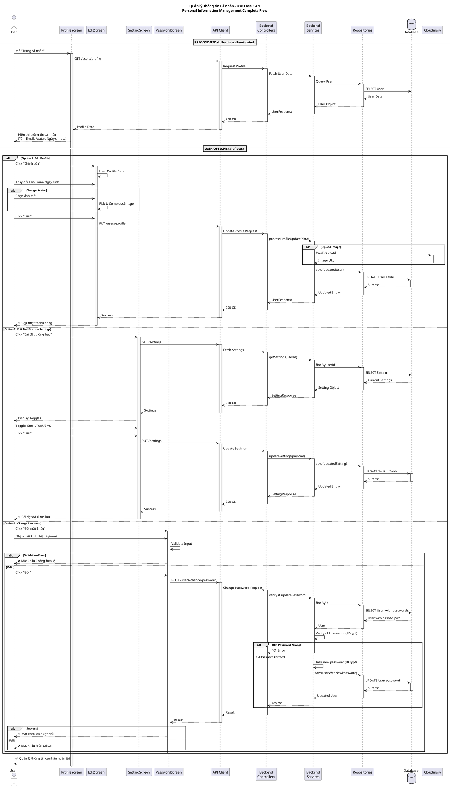

# Sequence Diagram - Quản lý Thông tin Cá nhân (Use Case 3.4.1)

## PlantUML Format - Complete Personal Information Management Flow

---

## Diagram 1: Xem Thông tin Cá nhân (View Profile)

---

## Diagram 2: Gộp 3 Use Case EXTEND (Edit Profile + Notification Settings + Change Password)

---

## Diagram 3: Complete Flow - Personal Information Management (All in One)

---

## Architecture Summary

### Frontend Layer (React Native)
- **ProfileScreen**: Display user profile information
- **EditProfileScreen**: Edit personal info (name, email, avatar, DOB)
- **NotificationSettingsScreen**: Toggle notification preferences
- **ChangePasswordScreen**: Change password with validation
- **API Client**: HTTP client handling requests

### Backend Layer (Spring Boot)
| Layer | Components |
|-------|-----------|
| **Controllers** | UserController, SettingController |
| **Services** | UserService, SettingService, PasswordEncoder |
| **Repositories** | UserRepository, SettingRepository |
| **Database** | MySQL - User, Setting tables |

### External Services
- **Cloudinary**: Image upload and storage

### Security
- **Password Hashing**: BCrypt with salt
- **Authorization**: Assumed authenticated (token in request)

---

**Format**: PlantUML (sequence diagrams)  
**Version**: 2.0  
**Last Updated**: 2026-05-21  
**Status**: Complete with 3 merged use cases in one comprehensive diagram
