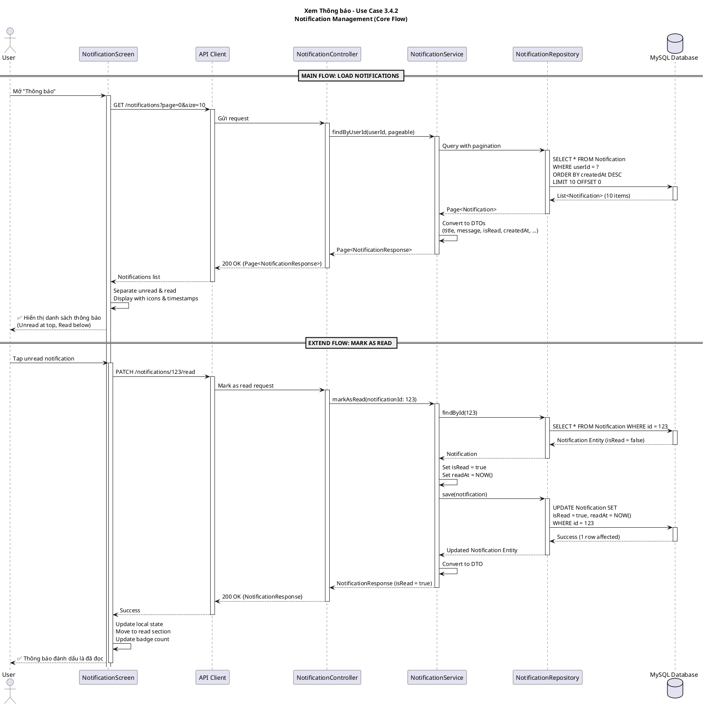

# Sequence Diagram - Xem Thông báo (Use Case 3.4.2)

## PlantUML - Core Notification Management (Load & Mark as Read)



---

## Architecture Summary

### Frontend (React Native)
- **NotificationScreen**: Display paginated notifications, tap to mark as read
- **API Client**: GET /notifications, PATCH /notifications/{id}/read

### Backend (Spring Boot)
| Component | Responsibility |
|-----------|---|
| **NotificationController** | GET /notifications (paginated), PATCH /notifications/{id}/read |
| **NotificationService** | findByUserId(pageable), markAsRead(id) |
| **NotificationRepository** | JPA queries with pagination |
| **Notification Entity** | id, userId, title, message, isRead, createdAt, readAt |

### Key Endpoints
- `GET /notifications?page=0&size=10` - Fetch paginated notifications
- `PATCH /notifications/{id}/read` - Mark single notification as read

### Data Model
```
Notification:
  - id (Long, PK)
  - userId (Long, FK)
  - title (String)
  - message (String)
  - type (String)
  - isRead (Boolean, default: false)
  - createdAt (Timestamp)
  - readAt (Timestamp, nullable)
```

---

**Format**: PlantUML  
**Version**: 2.0 (Simplified)  
**Use Case**: 3.4.2 - Xem Thông báo  
**Core Flows**: Load notifications + Mark as read  
**Last Updated**: 2026-05-21
