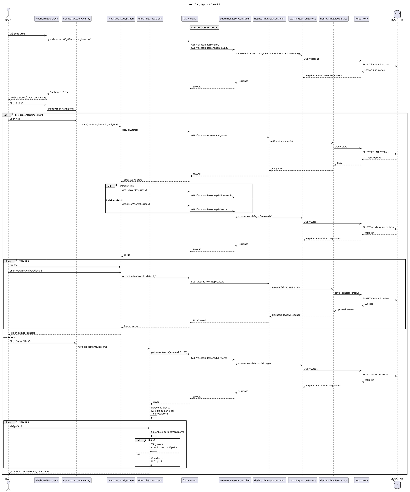

# Sequence Diagram - Học từ vựng (Use Case 3.5)

**Scope thật từ code:**
- **FE**: `FlashcardSetScreen`, `FlashcardActionOverlay`, `FlashcardStudyScreen`, `FillBlankGameScreen`
- **BE**: `LearningLessonController`, `FlashcardReviewController`, `LearningLessonService`, `FlashcardReviewService`
- **Game**: xử lý local ở FE, chỉ gọi API lấy danh sách từ
- **Study**: FE gọi API lưu review từng từ

