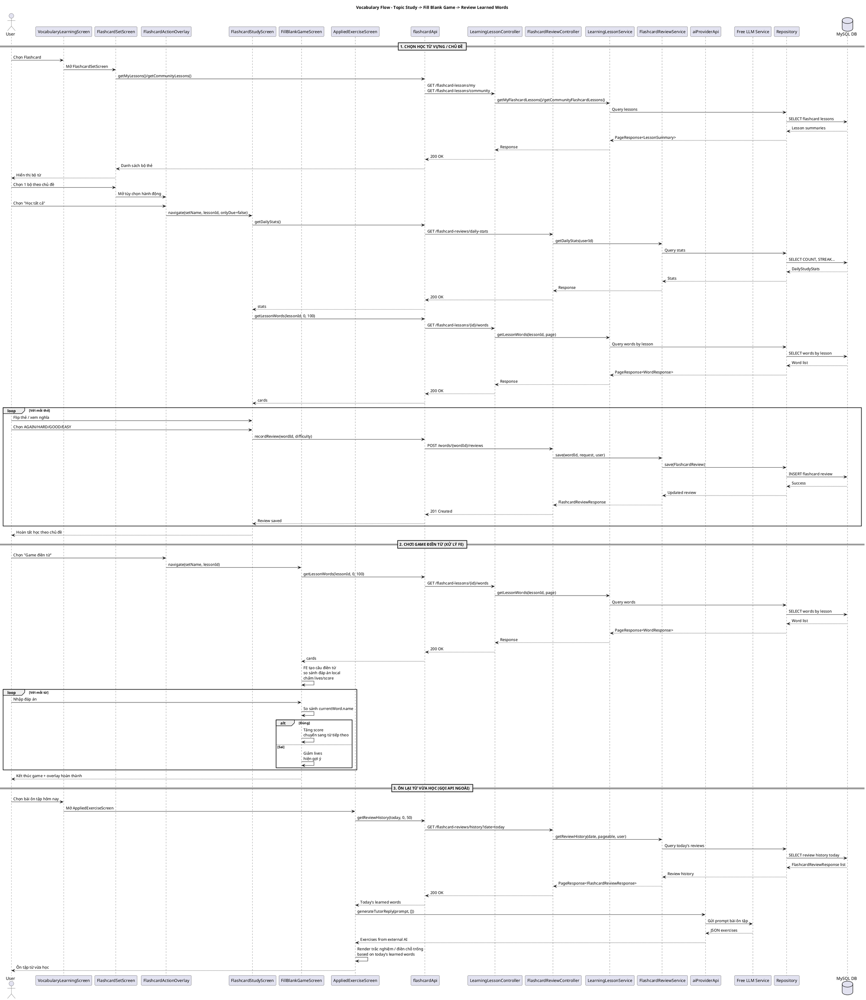

# Sequence Diagram - Học theo chủ đề -> Game điền từ -> Ôn lại từ vừa học

**Thành phần thực tế dùng trong code:**
- **FE:** `VocabularyLearningScreen`, `FlashcardSetScreen`, `FlashcardActionOverlay`, `FlashcardStudyScreen`, `FillBlankGameScreen`, `AppliedExerciseScreen`
- **BE:** `LearningLessonController`, `FlashcardReviewController`, `LearningLessonService`, `FlashcardReviewService`
- **API ngoài:** `aiProviderApi` -> `Free LLM Service`

