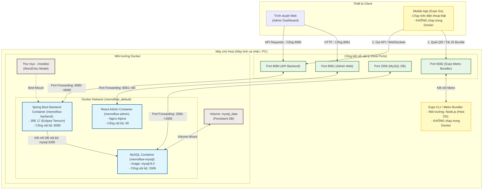

# CHƯƠNG 4: TRIỂN KHAI HỆ THỐNG

## 4.1. Mô hình triển khai hệ thống (Deployment Diagram)

Sơ đồ dưới đây mô tả cách thức đóng gói các dịch vụ của Memoflow dưới dạng container Docker, quy hoạch cổng mạng (ports) kết nối và cơ chế tải mã nguồn di động (Expo) ngoài Docker:



*   **Cơ chế liên kết:** Các dịch vụ MySQL, Backend, Admin Web chạy tách biệt trong các container nội bộ Docker. Tệp mô hình Word2Vec nặng (~1.5GB) được gắn động bằng cơ chế **Bind Mount** vào Backend container để tối ưu kích thước image. 
*   **Ứng dụng Mobile:** Khởi chạy bằng Node.js trực tiếp trên máy Host nhằm giữ khả năng phát triển linh hoạt (Metro Bundler) phục vụ việc quét mã QR để khởi chạy bằng **Expo Go** trên thiết bị thật.

---

## 4.2. Quy trình cài đặt và triển khai

### 4.2.1. Yêu cầu môi trường
*   **Hệ điều hành:** macOS, Linux hoặc Windows 10/11 (WSL2).
*   **Phần mềm:** Docker Desktop (hoặc Docker Engine), Node.js (v18 trở lên), và app **Expo Go** trên điện thoại.
*   **Phần cứng:** Bộ nhớ RAM trống tối thiểu **6GB - 8GB** (do mô hình Word2Vec chiếm dụng bộ nhớ RAM lớn).

### 4.2.2. Các bước cài đặt và chuẩn bị
1. **Tải mã nguồn:**
   ```bash
   git clone <URL_REPOS_MEMOFLOW>
   cd Memoflow
   ```
2. **Thiết lập mô hình Word2Vec:**
   * Tải tệp mô hình `GoogleNews-vectors-negative300-SLIM.bin`.
   * Tạo thư mục `models/` tại gốc dự án và sao chép tệp tin vừa tải vào đó.
3. **Cấu hình môi trường:**
   * Copy file `.env.example` thành `.env` ở gốc dự án. Các tham số cấu hình mặc định đã được thiết lập sẵn cho việc chạy localhost.

### 4.2.3. Quy trình chạy toàn bộ ứng dụng (Tự động bằng Script)
Để tối ưu hóa trải nghiệm khởi chạy, dự án cung cấp tập lệnh tự động hóa `run_app.sh` ở thư mục gốc. Bạn chỉ cần thực hiện:

1. **Cấp quyền và chạy script khởi động:**
   ```bash
   chmod +x run_app.sh
   ./run_app.sh
   ```
   *Script sẽ tự động dò tìm IP LAN máy tính, ghi cấu hình biến môi trường API cho Mobile, bật các container Docker chạy nền và kích hoạt Expo server hiển thị mã QR.*

2. **Quét mã QR để mở ứng dụng di động:**
   * Kết nối điện thoại di động cá nhân vào **chung mạng Wi-Fi/LAN** với máy tính.
   * **Android:** Sử dụng chức năng quét mã QR trong app **Expo Go**.
   * **iOS:** Mở ứng dụng **Camera** mặc định để quét mã và nhấn mở qua ứng dụng **Expo Go**.

3. **Truy cập các dịch vụ và tài khoản thử nghiệm:**
   * **Admin Web Dashboard:** [http://localhost:8081](http://localhost:8081)
     * *Đăng nhập Admin:* `admin@example.com` / `123456`
   * **Backend REST API:** [http://localhost:8080](http://localhost:8080)
     * *Đăng nhập Học viên (Mobile):* `testuser@example.com` / `123456`

4. **Tắt hệ thống:**
   ```bash
   docker compose down
   ```
