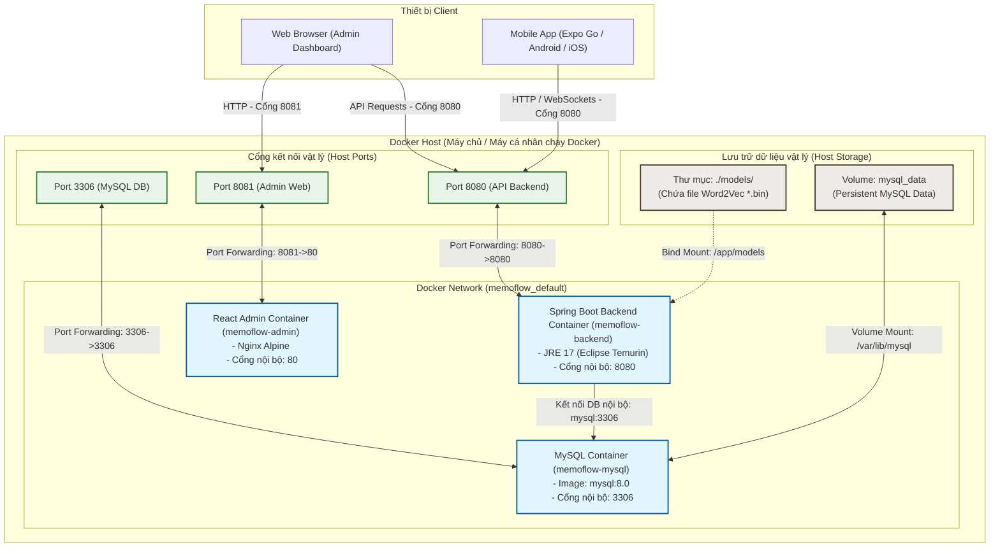

# CHƯƠNG 4: TRIỂN KHAI HỆ THỐNG

## 4.1. Mô hình triển khai hệ thống (Deployment Diagram)

Khác với kiến trúc logic (chỉ tả luồng nghiệp vụ giữa các lớp đối tượng bên trong phần mềm), **Mô hình triển khai vật lý (Physical Deployment Diagram)** dưới đây mô tả cách thức đóng gói các dịch vụ của Memoflow dưới dạng container, phân bổ cổng mạng (ports) và cơ chế lưu trữ dữ liệu (volumes/bind mounts) trên hạ tầng Docker:



### Mô tả cơ chế hoạt động của mô hình triển khai:
1. **Network Cô Lập (Docker Network):** Ba container (`memoflow-mysql`, `memoflow-backend`, `memoflow-admin`) được đặt chung trong một mạng ảo nội bộ để giao tiếp an toàn và nhanh chóng thông qua Service Name (ví dụ: Backend gọi Database qua `jdbc:mysql://mysql:3306/memoflow`).
2. **Decouple Word2Vec Model (Tách biệt Model nặng):** 
   Do file model Word2Vec (`GoogleNews-vectors-negative300-SLIM.bin`) có dung lượng lớn (~1.5 GB), việc đóng gói trực tiếp vào Docker Image sẽ làm tăng kích thước image lên mức không thể chấp nhận được. Hệ thống giải quyết bằng cách áp dụng **Bind Mount Volume** từ thư mục `./models` trên máy host vào `/app/models` trong Container. Điều này giữ Docker Image của Backend luôn nhẹ gọn (~250MB) và dễ phân phối.
3. **Data Persistence:** Phân vùng lưu trữ cơ sở dữ liệu được map vào ổ cứng máy host thông qua Docker volume named `mysql_data` để đảm bảo dữ liệu không bị mất khi dừng hoặc restart container.

---

## 4.2. Quy trình cài đặt và triển khai

### 4.2.1. Yêu cầu môi trường

Để cài đặt và chạy toàn bộ hệ thống Memoflow, thiết bị triển khai cần đáp ứng các điều kiện sau:

*   **Hệ điều hành:** macOS, Linux hoặc Windows 10/11 (hỗ trợ WSL2).
*   **Phần mềm yêu cầu:**
    *   **Docker Desktop** (hoặc Docker Engine & Docker Compose phiên bản v2.0 trở lên).
    *   **Git** để clone mã nguồn.
*   **Yêu cầu tài nguyên tối thiểu:**
    *   **RAM trống:** Tối thiểu **6GB - 8GB** (Spring Boot chiếm ~1GB, MySQL chiếm ~500MB, và thư viện DeepLearning4J khi nạp model Word2Vec cần tối thiểu khoảng **4GB RAM** để ánh xạ các véc-tơ từ).

---

### 4.2.2. Các bước cài đặt

#### Bước 1: Clone dự án
Mở Terminal/Command Prompt và tải mã nguồn dự án từ repository:
```bash
git clone <URL_REPOS_MEMOFLOW>
cd Memoflow
```

#### Bước 2: Tải và thiết lập Word2Vec Model
1. Tải tệp mô hình Word2Vec đã thu gọn (SLIM) từ các nguồn mở hoặc link Google Drive dự phòng của nhóm:
   * **Tên file yêu cầu:** `GoogleNews-vectors-negative300-SLIM.bin`
2. Tạo thư mục tên là `models` tại thư mục gốc của dự án (nằm cùng cấp với file `docker-compose.yml`):
   ```bash
   mkdir models
   ```
3. Di chuyển hoặc sao chép file mô hình đã tải vào thư mục này:
   ```bash
   # Cấu trúc thư mục mong muốn sau khi copy:
   Memoflow/
   ├── models/
   │   └── GoogleNews-vectors-negative300-SLIM.bin
   ├── BackEnd/
   ├── FrontEnd/
   └── docker-compose.yml
   ```

#### Bước 3: Khởi tạo tệp cấu hình môi trường (.env)
1. Copy file `.env.example` thành `.env`:
   ```bash
   cp .env.example .env
   ```
2. Mở file `.env` và kiểm tra/chỉnh sửa cấu hình nếu cần (mặc định đã được thiết lập tối ưu cho môi trường local chạy localhost):
   * `DB_ROOT_PASSWORD`: Mật khẩu root của MySQL.
   * `SPRING_SQL_INIT_MODE`: Đặt là `always` trong lần chạy đầu tiên để nạp dữ liệu mẫu (`data.sql`), đổi thành `never` ở các lần chạy sau để tránh ghi đè dữ liệu.
   * `VITE_API_URL`: Địa chỉ API của Backend (mặc định là `http://localhost:8080`).

---

### 4.2.3. Các bước chạy hệ thống

#### Bước 1: Build và khởi động các Container
Thực hiện lệnh sau tại thư mục gốc của dự án để tải thư viện, biên dịch ứng dụng và khởi chạy các dịch vụ chạy ngầm:
```bash
docker compose up -d --build
```

#### Bước 2: Theo dõi quá trình khởi chạy & nạp dữ liệu (Seeding)
Hệ thống sẽ mất từ 30s - 1 phút ở lần khởi chạy đầu tiên để tạo các bảng cơ sở dữ liệu, chạy script `data.sql` và load model Word2Vec vào RAM. Kiểm tra trạng thái bằng lệnh:
```bash
docker compose logs -f backend
```
Khi màn hình xuất hiện thông báo sau, hệ thống đã sẵn sàng:
```text
Tomcat started on port 8080 (http) with context path '/'
Started MemoflowApplication in XX.XXX seconds
```

#### Bước 3: Truy cập và kiểm thử ứng dụng
*   **Giao diện Quản trị viên (Admin Web Dashboard):** Truy cập địa chỉ [http://localhost:8081](http://localhost:8081)
*   **Địa chỉ API Backend:** [http://localhost:8080](http://localhost:8080)
*   **Tài khoản Test mặc định (Đã có sẵn dữ liệu mẫu):**
    *   *Tài khoản Admin:* Email: `admin@example.com` / Mật khẩu: `123456`
    *   *Tài khoản Học viên:* Email: `testuser@example.com` / Mật khẩu: `123456`

#### Bước 4: Dừng và tắt các Container khi hoàn tất
Khi muốn dừng hệ thống mà vẫn giữ nguyên dữ liệu trong DB, chạy lệnh:
```bash
docker compose down
```
Nếu muốn xóa sạch container và dữ liệu để chạy lại từ đầu, thêm cờ `-v`:
```bash
docker compose down -v
```
