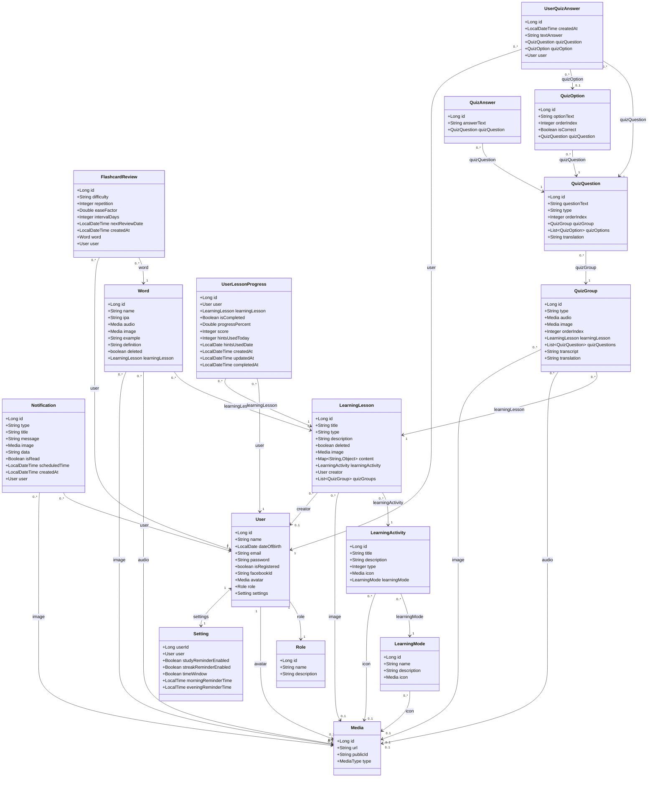

# Sơ đồ Lớp (Class Diagram) - Các Chức Năng Cốt Lõi của Memoflow (Cập nhật)

Dưới đây là sơ đồ lớp chi tiết biểu diễn các Thực thể (Entities) của hệ thống tương ứng với các chức năng yêu cầu (đã loại bỏ: `VerificationCode`, `Message`, `DeviceToken`, `ChatSession` theo yêu cầu):
1. **Quản lý thông tin cá nhân**: Cập nhật, bảo mật thông tin tài khoản.
2. **Thông báo thời gian thực (realtime)**: Sử dụng WebSocket kết nối người dùng.
3. **Học từ vựng qua Flashcard (cá nhân hóa, game hóa & tích hợp Gemini AI)**: Lịch học nhắc nhở theo đường cong lãng quên (SuperMemo SM-2), câu hỏi sinh bởi AI, trò chơi hóa điền từ.
4. **Thống kê học tập**: Theo dõi tiến độ cho cả 3 kỹ năng (Vocabulary, Listening, Grammar).

